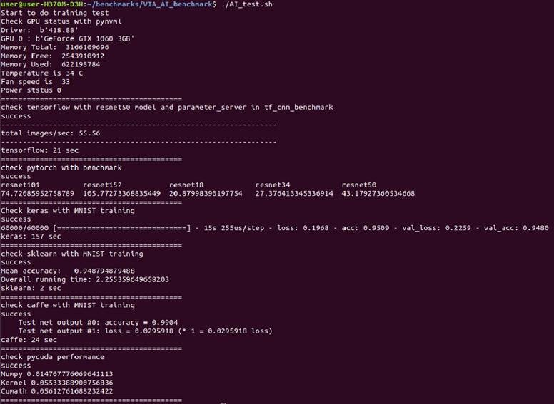
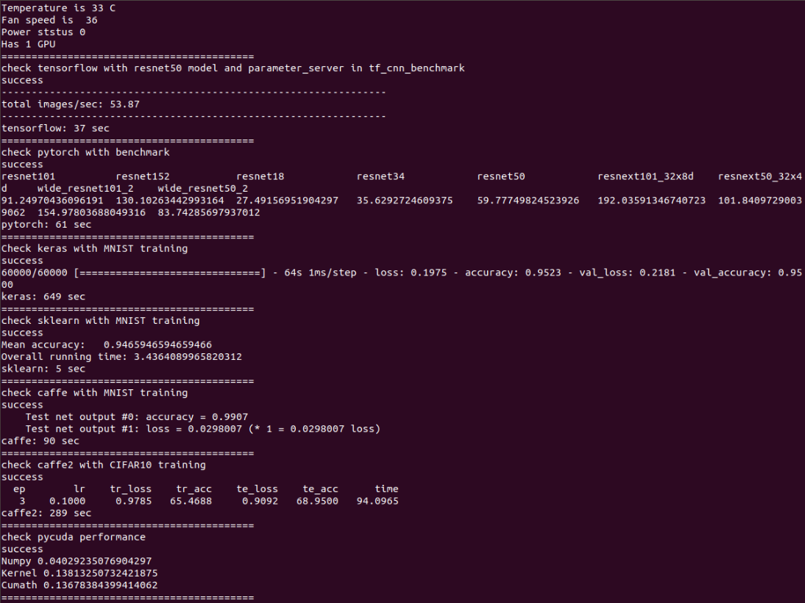

### Execution


```
# Test AI framework can work
sudo ./AI_test.sh

``` 

### Notice
If you use copy and paste way from Windows System, you need to do these command before execution.

```
sudo apt-get install dos2unix
dos2unix AI_test.sh

```


